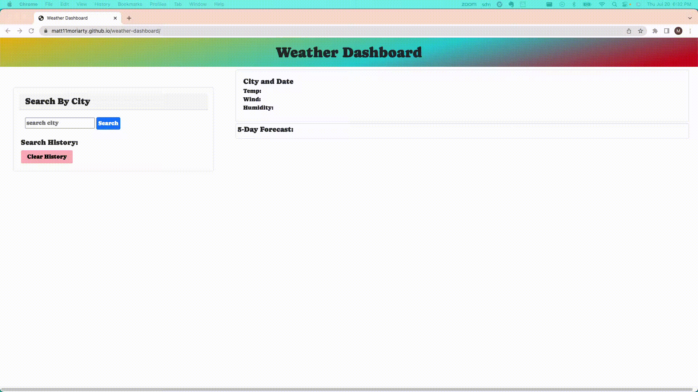

# Weather Dashboard

## Description

This dashboard was created so that anyone who want's to know the current weather of a city, as well as the five-day forecast, can do so!
If you are planning a trip, or are just curious, type in the name of the city who's weather you are interested in and it will be displayed automatically!

In building this dashboard, I became very comfortable working with third party API's such as openweathermap and fonts.google, and using the data they provide to generate dynamic applications. 
I also solidified my understanding of bootstrap, and put it to good use in building what I would consider a visually appealing interface.
```
GIVEN a weather dashboard with form inputs
WHEN I search for a city
THEN I am presented with current and future conditions for that city and that city is added to the search history ✔️
WHEN I view current weather conditions for that city
THEN I am presented with the city name, the date, an icon representation of weather conditions, the temperature, the humidity, and the wind speed ✔️
WHEN I view future weather conditions for that city
THEN I am presented with a 5-day forecast that displays the date, an icon representation of weather conditions, the temperature, the wind speed, and the humidity ✔️
WHEN I click on a city in the search history
THEN I am again presented with current and future conditions for that city ✔️
```

## Table of Contents

- [Weather Dashboard](#weather-dashboard)
  - [Description](#description)
  - [Table of Contents](#table-of-contents)
  - [Installation](#installation)
  - [Usage](#usage)
  - [Credits](#credits)
  - [License](#license)
  - [Badges](#badges)
  - [Features](#features)
  - [How to Contribute](#how-to-contribute)
  - [Tests](#tests)

## Installation

N/A

## Usage

Site URL: https://matt11moriarty.github.io/weather-dashboard/

1. Navigate to the site listed above
2. Enter any desired city in the input bar
   1. Invalid entries will get an alert
3. Input will be saved to search history in local storage
4. Current weather report for the city will be displayed in the top section
5. Five day forecast will be displayed in the bottom section
6. If you click on an item in the search history, it will run again for that city
7. Clear history button removes the history list from local storage





## Credits
Resources:

1. 5-day forecast: https://openweathermap.org/forecast5
2. Current weather: https://openweathermap.org/weather-conditions
3. Geocoding API: https://openweathermap.org/api/geocoding-api
4. Search history: https://stackoverflow.com/questions/35645373/is-there-any-jquery-plugin-available-to-show-recent-search-history
5. Gradient maker: https://cssgradient.io/
6. Nested fetches: https://stackoverflow.com/questions/40981040/using-a-fetch-inside-another-fetch-in-javascript
7. Skip through an array: https://stackoverflow.com/questions/33482812/javascript-take-every-nth-element-of-array
8. For - in loop: https://developer.mozilla.org/en-US/docs/Web/JavaScript/Reference/Statements/for...in
9. Current date (no jquery): https://www.freecodecamp.org/news/javascript-get-current-date-todays-date-in-js/
10. Opacity on bg but not text: https://www.geeksforgeeks.org/set-the-opacity-only-to-background-color-not-on-the-text-in-css/
11. Get the icons to show: https://stackoverflow.com/questions/44177417/how-to-display-openweathermap-weather-icon
12. Google fonts: https://fonts.google.com/knowledge/using_type/using_web_fonts
13. Font awesome: https://fontawesome.com/icons/poo-storm?f=classic&s=solid

## License

N/A

## Badges

N/A

## Features

Displays current weather and five day forecast for specific city based on user input.

## How to Contribute

N/A

## Tests

N/A
